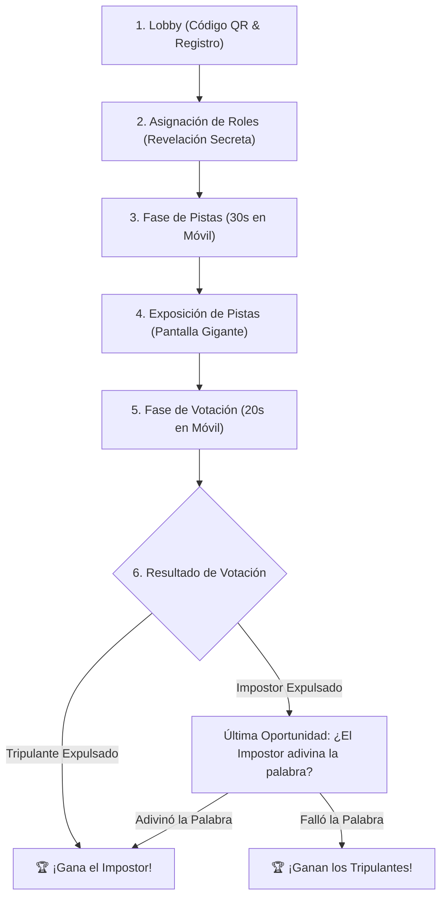

# 🕵️ Plan de Proyecto: CodeImpostor (Versión Final)

**CodeImpostor** es un juego multijugador de deducción social en tiempo real (estilo *Among Us* / *El Topo*) diseñado para la clase de **Administración de Proyectos de Software**.

Se ejecuta 100% en la **misma Red Wi-Fi (con o sin Internet)**. La pantalla del **Host (Proyector)** muestra el avance del juego mientras los compañeros participan simultáneamente desde sus **Teléfonos Móviles** escaneando un código QR generado dinámicamente con la IP local de la laptop.

---

## 🎭 1. Roles y Concepto del Juego

- **Tripulantes (Programadores)**: Conocen la **Palabra Secreta** (un concepto de software o gestión de proyectos, ej. `"SCRUM"`, `"GIT COMMIT"`, `"REFACTORIZACIÓN"`). Su objetivo es dar una pista suficiente para demostrar que conocen la palabra sin ponérsela fácil al Impostor, e identificar quién miente.
- **Impostor (El Bug / Infiltrado)**: **NO conoce la palabra secreta** (su pantalla muestra *"⚠️ ERES EL IMPOSTOR. ¡Disimula!"*). Su objetivo es leer las pistas de los demás, escribir una pista convincente, evitar ser votado y, si lo descubren, adivinar la palabra secreta en el último segundo.

---

## ⏱️ 2. Flujo Completo de una Partida (Paso a Paso)



### Paso 1: Lobby (Sala de Espera)
- **Pantalla Gigante (Host)**: Muestra un Código QR gigante apuntando a la IP local (ej. `http://192.168.1.45:5173`), el código de sala (ej. `#8492`), los avatares de los jugadores que se van uniendo en tiempo real y el botón **"¡Iniciar Partida!"**.
- **Móvil (Jugador)**: Escanea el QR, ingresa su apodo, elige un avatar/color y espera el inicio.

### Paso 2: Revelación de Roles (Secret Reveal)
- Cada jugador mira su celular:
  - **Tripulante ve**: *"Tu palabra secreta es: REFACTORIZACIÓN"*.
  - **Impostor ve**: *"⚠️ ERES EL IMPOSTOR. No conoces la palabra. ¡Lee las pistas y disimula!"*.

### Paso 3: Fase de Pistas (Hint Phase - 30 Segundos)
- Cada jugador escribe una pista corta en su teléfono (una palabra o frase breve).
  - *Tripulantes*: Pista prudente (si es muy obvia, el Impostor sabrá la palabra).
  - *Impostor*: Pista ambigua que encaje con el tema de software.

### Paso 4: Exposición y Debate en Pantalla Gigante
- Las pistas de todos aparecen simultáneamente en la pantalla del proyector junto a sus avatares.
- Temporizador de debate (45 segundos) con música ambiental de tensión para discutir al sospechoso.

### Paso 5: Votación (Voting Phase - 20 Segundos)
- En su teléfono, cada jugador vota por quién cree que es el Impostor (o *Saltar Voto*).
- En la pantalla gigante se ve la barra de progreso de votos en tiempo real.

### Paso 6: Animación de Expulsión y Condición de Victoria
- **Animación en Proyector**: Conteo de votos con animación dramática de expulsión.
- **Si expulsan a un Tripulante inocente**: 💥 **¡GANA EL IMPOSTOR!**
- **Si expulsan al IMPOSTOR**: 🚨 **Última oportunidad**: El Impostor elige entre 4 opciones de palabras clave en su teléfono. Si adivina la correcta, ¡roba la victoria! De lo contrario, **¡GANAN LOS TRIPULANTES!**

---

## 💻 3. Arquitectura Técnica & Abstracción Cómoda (`useGameSocket`)

### Stack Tecnológico
- **Frontend**: React 19 + TypeScript + Vite.
- **Estilos**: Vanilla CSS con variables, modo oscuro cyberpunk/glassmorphism, animaciones y diseño adaptativo.
- **Real-time Local**: Node.js / Express con **Socket.io** (100% offline en Wi-Fi local).
- **Generador QR**: `qrcode.react` en la vista del Host.

### Abstracción Cómoda con React Context (`useGameSocket`)
Para facilitar el desarrollo, el WebSocket estará completamente encapsulado en `SocketContext.tsx`. Los componentes de UI solo llamarán a funciones limpias:

```tsx
// Ejemplo de uso en cualquier componente React:
const { roomState, isHost, joinRoom, submitHint, castVote } = useGameSocket();
```

### Estructura de Archivos del Proyecto
```
proyecto-personal/
├── server/                    # Servidor WebSockets con Socket.io
│   ├── index.js               # Lógica del servidor, salas y estados de juego
│   └── words.js               # Banco de palabras clave de software/proyectos
├── src/
│   ├── components/
│   │   ├── HostLobby.tsx      # Vista del proyector: QR, jugadores y código de sala
│   │   ├── HostShowcase.tsx   # Vista del proyector: Muestra pistas y debate
│   │   ├── HostResult.tsx     # Vista del proyector: Animación de expulsión y ganador
│   │   ├── PlayerJoin.tsx     # Vista móvil: Formulario de ingreso (Nombre + Avatar)
│   │   ├── PlayerRole.tsx     # Vista móvil: Revelación de palabra o Impostor
│   │   ├── PlayerHint.tsx     # Vista móvil: Input para enviar pista
│   │   └── PlayerVote.tsx     # Vista móvil: Botones para votar al sospechoso
│   ├── context/
│   │   └── SocketContext.tsx  # Custom Hook (useGameSocket) y proveedor WebSocket
│   ├── App.tsx                # Enrutador principal (Host vs Jugador)
│   └── index.css              # Estilos Cyberpunk / Glassmorphism
├── IDEAS_PROYECTO.md
├── PLAN_CODEIMPOSTOR.md
└── package.json
```

---

## 📦 4. Dependencias a Instalar

- **Servidor (`server/`)**: `express`, `socket.io`, `cors`.
- **Cliente (`src/`)**: `socket.io-client`, `qrcode.react`, `canvas-confetti` (para la celebración final).

---

## 📋 5. Hoja de Ruta de Desarrollo

1. **Paso 1**: Instalación de dependencias y configuración del script de arranque.
2. **Paso 2**: Desarrollo del Servidor Backend (`server/index.js` + `server/words.js`).
3. **Paso 3**: Creación del contexto y Custom Hook `useGameSocket` (`src/context/SocketContext.tsx`).
4. **Paso 4**: Construcción de las Vistas del Host (Pantalla de Proyector con QR).
5. **Paso 5**: Construcción de las Vistas del Jugador (Interfaz táctil móvil).
6. **Paso 6**: Estilizado Cyberpunk/Glassmorphism y prueba de partida en tiempo real.
